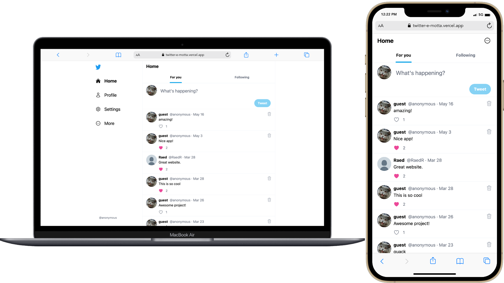

# TOP Project: JavaScript Final Project

- If you're not logged in, you'll only be able to see the Home timeline.
- You can sign up by logging in, in the log in page (only option is with a Google account for now). You'll be asked to choose a name and a username if it's your first time logging in.
- You can also log in as a "guest" if you choose that option in the log in page. Anyone who chooses this option will be logged in with the same account. - This is for demonstration purposes only, for anyone who doesn't want to sign up with their own account.
- Once you're logged in, there's a "For you" tab and a "Following" tab in the Home page.
- You can tweet up to 280 characters of text. Images and video are not supported. You can delete your own tweets.
- You can follow and be followed by anyone. There's a "Following" and a "Followers" tab in each profile.
- You can like any tweet.
- In the settings page, you can edit your name and username, as well as add Profile and Background images. (The image upload part was a bit of a rush job, so the code is somewhat messy).

## Technology

- Vite
- TypeScript
- React
- Firebase (Authentication, Firestore, Storage)
- Tailwind CSS

## Preview

## Screenshots

## Live preview

- [See the live preview here](https://twitter-e-motta.vercel.app/)

## Project assignment

- [See the project assignment here](https://www.theodinproject.com/lessons/node-path-javascript-javascript-final-project)
